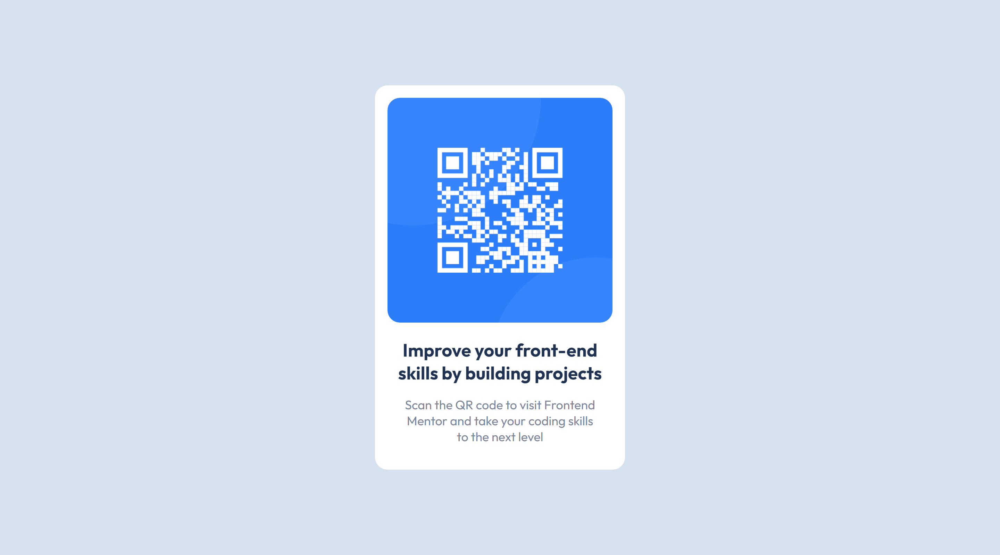

# Frontend Mentor - QR code component solution

This is a solution to the [QR code component challenge on Frontend Mentor](https://www.frontendmentor.io/challenges/qr-code-component-iux_sIO_H). Frontend Mentor challenges help you improve your coding skills by building realistic projects. 

## Table of contents

- [Overview](#overview)
  - [Screenshot](#screenshot)
  - [Links](#links)
- [My process](#my-process)
  - [Built with](#built-with)
  - [What I learned](#what-i-learned)
  - [Continued development](#continued-development)
- [Author](#author)

## Overview

This is the first recommended project to start with as a beginner on Frontend Mentor, and is part of the
Getting Started on Frontend Mentor (beginner) roadmap.

### Screenshot

### Links
- Solution URL: [Frontend Mentor Solution](https://www.frontendmentor.io/solutions/mobilefirst-solution-using-css-flexbox-and-media-queris-kzA5hCiALD)
- Live Site URL: [Live Site](https://frontendmentor-ilyesab.github.io/qr-code-component/)

## My process

### Built with

- Semantic HTML5 markup
- CSS custom properties
- Flexbox
- Mobile-first workflow

### What I learned

The main point of learning in this challenge since it's my first one. was taking the design from the images of the mobile version and desktop version and think of a way to structure the html to allow me to style the different components of the challenge in an easy way.

I also introduced myself to variable fonts a concept I was not aware of.

### Continued development

As part of working on this project I'm interested in learning more about variable fonts and typography in general.

## Author

- Frontend Mentor - [@ilyesab](https://www.frontendmentor.io/profile/ilyesab)

